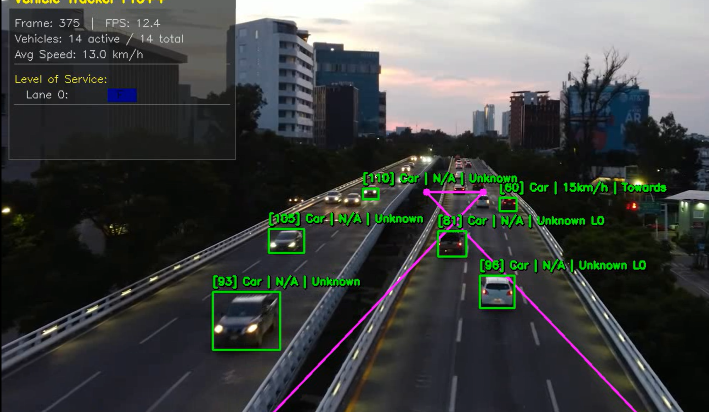

# 🚗 Vehicle Tracker Pro++



**نظام تتبع مروري احترافي متعدد الطبقات** - قياس سرعة، كشف مخالفات، وتحليل كثافة مرورية باستخدام YOLOv8 و ByteTrack مع تحويل منظور الطائر (BEV).

---

## 📋 المميزات

| الميزة | الوصف |
|--------|-------|
| 🎯 **تتبع دقيق** | YOLOv8 + ByteTrack لتتبع المركبات في الزمن الفعلي |
| 📐 **معايرة BEV** | تحويل إحداثيات البكسل إلى أمتار حقيقية (Homography Matrix) |
| 🏎️ **قياس سرعة** | حساب السرعة بالكيلومتر/ساعة بدقة عالية |
| 🚦 **بوابات افتراضية** | قياس سرعة العبور بين نقطتين (Trap Speed) |
| ⚠️ **كشف مخالفات** | تجاوز السرعة، السير العكسي، التلاحق، التوقف الطارئ |
| 🛣️ **تصنيف الحارات** | توزيع المركبات على الحارات مع نافذة استقرار (Stability Window) |
| 📊 **مستوى الخدمة** | حساب الكثافة المرورية ومستوى الخدمة (LoS A-F) حسب معايير HCM |
| 💾 **قاعدة بيانات** | SQLite مع كاتب غير متزامن (Async Writer) لمنع اختناق المعالجة |
| 📸 **لقطات المخالفات** | حفظ صور تلقائية للأحداث الحرجة |
| 🎨 **لوحة معلومات** | Dashboard مرسوم على الفيديو مباشرة |
| 🌐 **دعم RTSP** | معالجة البث المباشر من الكاميرات |

---

## 🏗️ الهيكل المعماري

```
Vehicle-Tracker-Pro-Plus/
├── 📄 README.md
├── 📄 config.json                 # إعدادات النظام
├── 📄 requirements.txt
│
├── 📂 config/
│   ├── 🗺️  gates.json            # تعريف البوابات الافتراضية
│   └── 🚦 lanes.json            # تعريف الحارات المرورية
│
├── 📂 data/                       # مخرجات (لا ترفع لـ Git)
│   ├── 📊 traffic.db
│   ├── 📸 snapshots/
│   └── 📈 reports/
│
└── 📂 src/                        # الكود المصدري
    ├── 🧠 core/                  # YOLO + VehicleManager
    ├── 📐 calibration/           # BEV Transformer
    ├── 🚦 gates/                 # Virtual Gates
    ├── ⚠️  events/               # Event Detectors (Observer Pattern)
    ├── 📊 analysis/              # Lane Assigner + Density + LoS
    ├── 💾 storage/               # SQLite + CSV + Snapshots
    ├── 🎨 visualization/         # Renderer + Dashboard
    └── ⚙️  main.py               # نقطة الدمج النهائية
```

---

## 🚀 تثبيت سريع

### المتطلبات
- Python 3.8+
- pip

### التثبيت

```bash
# استنساخ المستودع
git clone https://github.com/medissaoui711/Vehicle-Tracker-Pro-Plus.git
cd Vehicle-Tracker-Pro-Plus

# إنشاء بيئة افتراضية
python -m venv venv

# تفعيل البيئة
# Windows:
venv\Scripts\activate
# Linux/Mac:
source venv/bin/activate

# تثبيت المكتبات
pip install -r requirements.txt
```

---

## ⚙️ الإعدادات

### 1. المعايرة (Calibration)

شغّل أداة المعايرة لتحديد 4 نقاط على الشارع:

```bash
python scripts/calibrate.py path/to/video.mp4
```

أو حدد النقاط يدوياً في `config.json`:

```json
"calibration": {
    "src_points": [[300, 700], [980, 700], [600, 300], [680, 300]],
    "dst_meters": [[0, 20], [10, 20], [0, 0], [10, 0]]
}
```

### 2. مصدر الفيديو

في `config.json`:

```json
"source": "video.mp4"       // ملف فيديو
"source": "rtsp://..."      // بث مباشر
"source": 0                 // كاميرا الويب
```

---

## 🎮 التشغيل

```bash
# وضع عادي مع عرض مرئي
python src/main.py

# وضع Headless (للخوادم)
python src/main.py --headless

# مع ملف إعدادات مخصص
python src/main.py --config my_config.json

# حفظ الفيديو الناتج
python src/main.py --output results.mp4
```

### مفاتيح التحكم

| المفتاح | الوظيفة |
|---------|----------|
| `q` | خروج |
| `ESC` | خروج |

---

## 📊 طبقات النظام

### 1️⃣ Core Layer - التتبع
- YOLOv8 للكشف عن المركبات
- ByteTrack للتتبع متعدد الكائنات
- VehicleManager لإدارة دورة حياة المركبات

### 2️⃣ Calibration Layer - المعايرة
- BEVTransformer: تحويل البكسل → أمتار
- دعم معايرة يدوية وتفاعلية

### 3️⃣ Gates Layer - البوابات
- بوابات افتراضية لقياس سرعة العبور
- كشف اتجاه المركبة (Towards/Away)
- Trap Speed بين أي بوابتين

### 4️⃣ Events Layer - المخالفات
- نمط Observer لربط الكاشفات
- كاشفات: تجاوز السرعة، سير عكسي، تلاحق، توقف طارئ
- عتبات ذكية لمنع الإنذارات الكاذبة

### 5️⃣ Analysis Layer - التحليل
- LaneAssigner مع نافذة استقرار
- DensityAnalyzer: كثافة مرورية + LoS (A-F)
- StatisticsCollector: إحصائيات الجلسة

### 6️⃣ Storage Layer - التخزين
- SQLite مع Async Writer (Queue + Thread)
- CSV للتقارير اليومية
- SnapshotCapture للقطات المخالفات

### 7️⃣ Visualization - التصور
- Renderer: رسم المركبات والبوابات
- Dashboard: لوحة معلومات مباشرة

---

## 🗄️ قاعدة البيانات

### الجداول

| الجدول | الوصف |
|--------|-------|
| `sessions` | جلسات التشغيل |
| `vehicles` | سجلات المركبات الدورية |
| `events` | جميع الأحداث المرورية |
| `density` | سجلات الكثافة المرورية |
| `daily_statistics` | إحصائيات يومية مجمعة |

### استعلام مثال

```sql
-- استعلام عن أحداث السير العكسي
SELECT * FROM events 
WHERE event_type = 'wrong_way' 
ORDER BY timestamp DESC 
LIMIT 10;
```

---

## 📈 المخرجات

- **فيديو معالج** مع مربعات التتبع ولوحة المعلومات
- **قاعدة بيانات SQLite** بجميع الأحداث والإحصائيات
- **ملفات CSV** للتقارير اليومية
- **لقطات صور** للمخالفات الخطيرة

---

## 🛠️ التقنيات المستخدمة

| التقنية | الاستخدام |
|---------|-----------|
| [Ultralytics YOLOv8](https://github.com/ultralytics/ultralytics) | كشف المركبات |
| [ByteTrack](https://github.com/ifzhang/ByteTrack) | تتبع متعدد الكائنات |
| OpenCV | معالجة الصور والتحويل الهندسي |
| NumPy | الحسابات الرياضية |
| SQLite | قاعدة البيانات المحلية |
| Threading + Queue | معالجة غير متزامنة |

---

## 📝 الترخيص

MIT License - انظر ملف [LICENSE](LICENSE)

---

## 👤 المؤلف

**Eng. Mohamed Alissawi** - [GitHub](https://github.com/medissaoui711)

---

⭐ **إذا أعجبك المشروع، لا تنسى إعطاء نجمة!**
